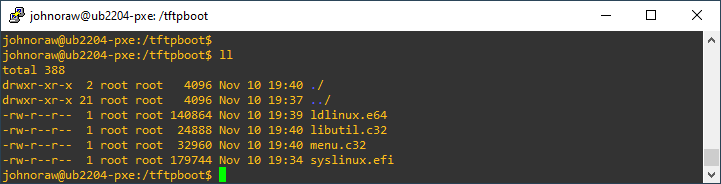

# PXE Boot

Create the following directories

```
mkdir /tftpboot
```

Install dependencies

```
sudo apt install -y syslinux-common syslinux-efi isc-dhcp-server tftpd-hpa
```

Create the following directories

```
mkdir tftpboot
cd tftpboot
```

Copy boot files previously installed in syslinux

```
cd /usr/lib/syslinux/modules/efi64
sudo cp ldlinux.e64 /tftpboot/
sudo cp libutil.c32 /tftpboot/
sudo cp menu.c32 /tftpboot/

cd /usr/lib/SYSLINUX.EFI/efi64/
sudo cp syslinux.efi /tftpboot
```

Then check /tftpboot to see if all four files are present.

<figure><figcaption></figcaption></figure>

Create a folder for configurations

```
cd /tftpboot/
sudo mkdir pxelinux.cfg
```

## Configure TFTPD

Edit the TFTPD configuration

```
cd /etc/default
sudo nano tftpd-hpa
```

Configure the file as shown and save

```
TFTP_OPTIONS="--secure"
TFTP_USERNAME="tftp"
TFTP_DIRECTORY="/tftpboot"
TFTP_ADDRESS="0.0.0.0:69"
TFTP_OPTIONS="--secure --create"
```

Now restart the service to take the new settings

```
sudo service tftpd-hpa restart
```

At my DHCP server, I add entries for PXE.

